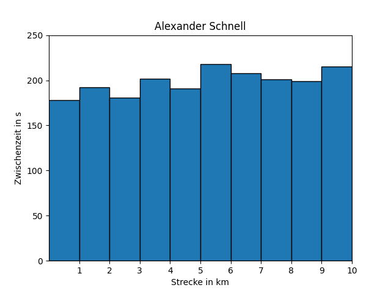

---
titlepage: true
titlepage-color: "ffffff"
titlepage-rule-color: "ffffff"
titlepage-text-color: "000000"
toc-own-page: true
colorlinks: false
title: Prüfungsvorbereitung EDA 
author:
- Yannick Hutter 
lang: de
date: "22.01.2024"
lof: true
mainfont: Liberation Sans
sansfont: Liberation Sans
monofont: JetBrains Mono
header-left: "\\small \\thetitle"
header-center: "\\small \\leftmark"
header-right: "\\small \\theauthor"
footer-left: "\\leftmark"
footer-center: ""
footer-right: "\\small Seite \\thepage"
...

\newpage
# Theorie

## Datenanalyse
Für eine erfolgreiche Datenanalyse sind Kompetenzen aus den Bereichen *Mathematik, Informatik sowie Fachdomänewissen* notwendig. Ein Data Scientist ist hierbei für die Datenanalyse zuständig, es gibt jedoch zwei wichtige Unterscheidungen:

* Der Data Scientist betrachtet praxis-relevante Fragestellungen ohne persönlich im Besitz von Domänen-Wissen zu sein.
* Der Data Scientist betrachtet praxis-relevante Fragestellungen und ist persönlich in Besitz von Domänen-Wissen

### Treiber
Die technologischen Treiber führen dazu, dass mittels Datenanalyse:

* bekannte praxis-relevante Fragestellungen besser, schneller und kostengünstiger beantwortet werden können
* neue praxis-relevante Fragestellungen beantwortet werden können

**Treiber aus dem Bereich Informatik und Mathematik**

Leistungsfähigere Modelle um Erkenntnisse aus Daten zu gewinnen

* Deep Learning Modelle
* Neuronale Netze
* NLP-Solver


**Treiber aus dem Bereich Hardware und Informatik**

Leistungsfähigere Technologien des Datentransports, der Datenverfügbarkeit und der Datenspeicherung

* Cloud 
* Internet
* 5G uvm.

\newpage
**Treiber aus dem Bereich Fachdomäne**

Produktion von mehr und günstigeren Sensoren

* GPS
* Finanzdaten
* Wetter
* Gelände
* IoT

## Deskriptive Statistik

Mathemtische Verfahren welche einen generellen Überblick über die Daten geben:

* Spannweite
* Minimum
* Maximum
* Mittelwert
* Median

Mathematische Verfahren welche aufzeigen, wie **stark die Daten schwanken**:

* Varianz
* Standardabweichung
* Quantile

### Best Practices

* Für Daten, die *halbwegs gleich verteilt* sind, ergeben Median/Qantil ungefähr dieselben Aussagen wie Mittelwert und Standardabweichung
* Für Daten, die ein oder mehrere deutliche "Ausreisser" aufweisen, also nicht gleich verteilt sind, ergeben Median/Qantil verschiedene Aussagen wie Mittelwert /Standardabweichung
* Wenn es "Lücken" (keine kompakte Verteilung der Daten) hat, gibt es einen grossen Unterschied zwischen Median und Mittelwert

\newpage
### Standardverfahren

**Spannweite**

Die Spannweite berechnet sich folgendermassen

$$ x_{Max} - x_{Min} $$

**Mittelwert**

Median und Mittelwert sind Grössen, die beschreiben "wie gross" die Zahlen sind. Der Mittelwert **reagiert auf Ausreisser**

$$ \bar{x} = \dfrac{1}{n} \sum_{i=1}^{n} x_i = \dfrac{x_1 + x_2 + ... + x_n}{n} $$

**Median**

Median reagiert praktisch **nicht auf Ausreisser**

Wenn $n$ **ungerade** ist

$$ \dfrac{x_{(n + 1)}}{2} $$

Wenn $n$ **gerade** ist

$$ \dfrac{x_{(n/2)} + x_{((n/2) + 1)}}{2} $$

### Schwankung der Werte erkennen

**Varianz**

Die Varianz ist die mittlere quadratische Abweichung zum Mittelwert.

$$ \dfrac{1}{n} \sum_{i=1}^{n} (x_i - \bar{x})^2 $$

\newpage
**Standardabweichung**

Die Standardabweichung ist die Wurzel aus der Varianz.

$$ std(x) = \rho(x) = \sqrt{var(x)} $$

**Quantile**

Quantile können schiefe Verteilungen (skewness) erkennen.

* Ein Quantil von 25% bedeutet, dass rund 25% der Daten unter diesem Wert liegen und 75% darüber
* Ein Quantil von 75% bedeutet, dass rund 75% der Daten unter diesem Wert liegen und 25% darüber

**Kovarianz**

Die Kovaria nz ist ein Mass für die Abweichung der Datenpunkte von der Ausgleichsgerade

$$ cov(x,y) = \dfrac{1}{n} \sum_{i=1}^{n} (x_i - \bar{x}) * (y_i - \bar{y}) $$

Um eine Normierung von -1 zu +1 zu erreichen, berechnet man noch den Korrelationskoeffizient. Hierbei wird 1 durch das Quadrat der Standardabweichung geteilt und mit der Kovarianz multipliziert

$$ \rho(x,y) = \dfrac{1}{std(x) * std(y)} * cov(x,y) $$

* Korrelationskoeffizient = -1 bedeutet, dass die Daten *perfekt anti-korrelieren*
* Korrelationskoeffizient = 0 bedeutet, dass die Daten *nicht korrelieren*
* Korrelationskoeffizient = 1 bedeutet, dass die Daten *perfekt korrelieren*

### Ausgleichsgerade
Eine Ausgleichsgerade kann mit dem $y_{Model}$ erklärt werden. $m$ ist hierbei die Steigung und $t$ ist der Achsenabschnitt.

$$ y_{Model} = m*x + t $$
$$ m = \dfrac{cov(x,y)}{var(x)} $$
$$ t = \bar{y} - m*\bar{x} $$


### Unterschied Korrelation und Kausalität
Eine **Korrelation** beschreibt den Zusammenhang zwischen zwei Grössen. Wenn sich eine Variable ändert, ändert sich auch die andere.
Eine **Kausalität** besagt, dass eine Ursache-Wirkungs-Beziehung zwischen den Grössen besteht.

Eine Korrelationsstudie ist im Gegensatz zu einer Kausalitätsstudie daher auch einfach, schnell und kostengünstig durchzuführen.

## Rechnen mit Vektoren

### Transponieren
Vektoren lassen sich von Zeilen zu Spaltenvektoren und umgekehrt mittels Transposition umwandeln

$$ \vec{a} = \begin{pmatrix} 0 \\ 0\\ 1 \end{pmatrix} = \vec{a^T} = \begin{pmatrix} 0 & 0 & 1 \end{pmatrix} $$

### Skalarprodukt
Das Skalarprodukt ist das innere Produkt der Vektoren. 

$$ \sum_{i=1}^{n} a_i * b_i $$

Bei dem Vektor $\vec{a} = \begin{pmatrix} 1 \\ 0\\ 0 \end{pmatrix}$ und Vektor $\vec{b} = \begin{pmatrix} 0 & 0 & 1 \end{pmatrix}$ ist das Skalarprodukt

$$ \vec{a} * \vec{b} = \begin{pmatrix} 0 \\ 0\\ 1 \end{pmatrix} * \begin{pmatrix} 0 & 0 & 1 \end{pmatrix} = a_1 * b_1 + a_2 * b_2 + ... $$

\newpage
* Skalarprodukt zwischen zwei Spaltenvektoren ist gültig, solange sie die **gleiche Anzahl an Elementen beinhalten**
* Skalarprodukt zwischen zwei Spalten und Zeilenvektor ist gültig, solange sie die **gleiche Anzahl an Elementen beinhalten**
* Skalarprodukt zwischen zwei Zeilenvektoren bspw. $\begin{pmatrix} 0 & 0 & 1 \end{pmatrix}$ und $\begin{pmatrix} 0 & 0 & 1 \end{pmatrix}$ **ist nicht definiert**

### Betrag / Länge
Die Länge eines Vektors kann berechnet werden, indem jede Komponente quadriert und aufsummiert wird. Am Schluss wird noch die Wurzel gezogen

$$ \lvert \vec{a} \rvert\ = \sqrt{a_1 * a_1 + a_2 * a_2 + ...} $$


### Addition
Wichtig zu beachten ist, dass nur **Vektoren des gleichen Typs** addiert werden können. Eine Addition zwischen Zeilen und Spaltenvektor ist daher nicht zulässig (der Vektor müsste transponiert werden)

## Ähnlichkeits-Analyse
Daten-basierte Cluster- und Ähnlichkeits-Analysen bilden die grundlage für personalisierte Internet-Werbung und sind somit das Kernstück zahlreicher Business-Modelle. Die technische Grundlage hinter diesen Analyseverfahren bildet die **N-dimensionale Vektorrechnung** und die **lineare Algebra**.

* Ausgangspunkt sind Kundendaten von m=1,...,M Kunden.
* Wir bilden daraus aussagekräftige N-dimensionale Merkmalsvektoren: $x_m = \begin{pmatrix} Alter \\ ... \end{pmatrix}$
* Wir normieren die Komponenten der Vektoren sinnvoll
* Wir stellen die Merksmalvektoren jedes Kunden in einem N-dimensionalen Raum dar.
* Wir berechnen die MxM-Abstandsmatrix (Abstand von jedem Kunden zu jedem anderen Kunden).
* Auf der Basis der Abstände können wir von jedem Kunden, z.B. die 100 ähnlichsten Kunden (= nächste Nachbarn) bestimmen.

## Datenhandling und Datacleaning
Prinzipiell ist es sehr wichtig, dass an **allen involvierten Stellen** ein **sauberes Datahandling** angestrebt wird.
Auch sollte immer von fehlerhaften Daten ausgegangen werden, mögliche Fehler für Daten sind beispielsweise:

* Abschreibefehler
* Übertragungsfehler
* Einlese-Fehler
* Schreib-Fehler

Prinzipiell sollte vorallem in folgenden Situationen die **Alarmlampe** angehen:

* Daten sind alt
* Daten sind über einen langen Zeitraum erhoben worden
* Daten wurden von verschiedenen Personen erhoben
* Daten wurden an verschiedenen Orten erhoben

Für ein erfolgreiches Datenhandling und Cleaning sollten zumindest die folgenden Schritte durchlaufen werden:

* Haltung und Einstellung: Betrachten Sie die Daten als einen wertvollen Schatz
* Daten leben: Beschäftigen Sie sich mit dem Vorleben der Daten.
* Daten verstehen: Betrachten Sie die Daten nicht als Zahlen oder Buchstaben, sondern als Bedeutungsträger
* Grundlegende statistische Analyse
* Vertrauensvoller Kontakt mit den Know-How-Trägern aus der Fachdomäne
* Daten-Verschmutzung vermeiden

{ height=200px }

## Umgang mit Datenfehlern
Um mit Datenfehlern umzugehen stehen unter anderem folgende Möglichkeiten zur Verfügung:

* Alles dokumentieren
* Rücksprache mit Domänen-Experten
* Löschen (nur in begründeten Fällen)
* Daten korrigieren (nur in begründeten Fällen)

## Datenglättung
Datenglättung kann verwendet werden um **hochfrequente Signale** zu entfernen und somit das **Erkennen von Trends** zu ermöglichen, d.h. Messrauschen entfernen. Hierzu gibt es verschiedene Verfahren:

* Gleitender Mittelwert (Moving-Average)
* Fourier-Filter (Glätten im Frequenz-Raum, hochfrequente Anteile abschneiden)
* Savitzky-Golay-Filter (stückweise Polynome fitten)

### Gleitender Mittelwert

* Je grösser die Fensterbreite (filter window), desto glatter das Ergebnis
* Zu grosse Filterbreiten zerstören das Signal

Der Anfang und das Ende der Daten muss separat behandelt werden:

* Kürzung in Kauf nehmen. Nachteil: Die Länge der Zeitreihe hängt von der Fensterbreite ab
* Zeitreihe mit Konstanten auffüllen. Vorteil: Die Länge der Zeitreihe und der gefilterten Zeitreihe bleibt unabhängig von der Fensterbreite gleich

\newpage
# Praxis

## Numpy

### Aufsummierte Summe bilden
Die aufsummierte Summe kann über den Befehl `cumsum` gebildet werden

```python
seconds_total_sum = seconds_total.cumsum()
```

Es ist auch möglich diese Zeilen oder Spaltenweise zu bilden (hilfreich bei mehrdimensionalen Arrays).

```python
seconds_total_sum = seconds_total.cumsum(1) # Spaltenweise
seconds_total_sum = seconds_total.cumsum(0) # Zeilenweise
```

### Standardwerte berechnen

```python
median = np.median(x)
max_value = max(x)
min_value = min(x)
mean = np.mean(x)
quant_25 = np.quantile(x, 0.25)
quant_75 = np.quantile(x, 0.75)
std = np.std(x)
variance = np.var(x)
```

### Bestimmtheitsmass berechnen
```python
rho = np.corrcoef(schuhgroesse,koerperlaenge)
bestimmtheit = rho**2
```

### CSV Dateien laden

```python
height = np.loadtxt("./data/nba.csv", delimiter=",", usecols=(1), skiprows=1) # dtype="U" means Unicode String
```

\newpage
### Bestimmte Werte filtern
Werte können mit dem `np.where` Befehl gefiltert werden.

```python
none_empty_values_indices = np.where(price_str != ".")
number_of_indices = len(none_empty_values_indices[0])
price = np.zeros(number_of_indices)

for i in range(number_of_indices):
    index = none_empty_values_indices[0][i]
    price[i] = float(price_str[index])
```

## Matplotlib

### Grafik als Bild abspeichern
```python
plt.savefig("./myImage.png")
```
> Achtung: Vorher kein `.plot()` Befehl ausführen da sonst das Bild nicht gespeichert wird.


### Darstellung einer Gerade
Eine einfache Gerade kann umgeben von einer Punktewolke mit Abstand $r$ zur Gerade kann folgendermassen dargestellt werden

```python
import numpy as np
import matplotlib.pyplot as plt

x = np.random.randn(1000)
r = 0.2
y = 1.2*x + 2.4 +r*np.random.randn(1000)
plt.figure()
plt.plot(x,y,'o',markersize=1)
```

### Ausgleichsgerade
Eine Ausgleichsgerade kann mit dem Befehl `polyfit` erzeugt werden:

```python
y_model = np.polyfit(seconds_total_per_runner, seconds_total_standard_deviation, 1)
m = y_model[0]
t = y_model[1]
plt.plot(seconds_total_per_runner, m * seconds_total_per_runner + t, 'r')
```
\newpage
### Balkendiagramm zeichnen
```python
...
plt.title("Alexander Schnell")
plt.axis([0, 10, 0, 250])
plt.bar(km - 0.5, time_seconds_total, edgecolor=(0, 0, 0), width=1)
plt.xticks(km)
plt.xlabel("Strecke in km")
plt.ylabel("Zwischenzeit in s")
plt.show()
```
{ height=300px }

\newpage
### Liniendiagramm zeichnen
```python
...
plt.figure(2)
plt.axis([0, 11, 0, 35])
plt.xticks(km)
plt.plot(km - 0.5, time_seconds_total_sum / 60, "ro-")
plt.xlabel("Strecke in km")
plt.ylabel("Zeit in min")
plt.show()
```

{ height=300px }

### Legende erzeugen
Eine Legende kann mit dem `legend` Befehl erzeugt werden:

```python
for i, name in enumerate(names):
        plt.plot(np.append(0, km), np.append(0, seconds_total_sum[i] / 60.0), "o-")
plt.legend(names, loc="center left")
```

\newpage
### Grid erzeugen
Ein Grid kann mit dem Befehl `grid` erzeugt werden

```python
plt.grid(visible=True)
```
### Heatmap erzeugen
Eine Heatmap kann mit dem Befehl `pcolor` erzeugt werden

```python
correlation_matrix = np.corrcoef(seconds_total)
plt.figure()
plt.pcolor(correlation_matrix)
plt.pcolor(correlation_matrix > 0.95)
plt.show()
```
### Abstandsmatrix berechnen

```python
def difference(a, b):
        result = (a - b) ** 2
        result = sum(result)
        result = np.sqrt(result)/len(b)
        return result

matrix = np.zeros((7, 7))
for i in range(len(names)):
    for j in range(len(names)):
        matrix[i, j] = difference(seconds_total[i], seconds_total[j])
plt.figure()
plt.pcolor(matrix)
plt.pcolor(matrix < 0.3)
```

### Gleitender Symmetrischer Mittelwertsfilter

```python
def moving_average(a, n):
    l=len(a)
    s=int((n-1)/2)
    b=np.zeros(l)
    for i in range(s,l-1-s):
        b[i] = sum(a[i-s:i+s+1])/n
    return b
```
